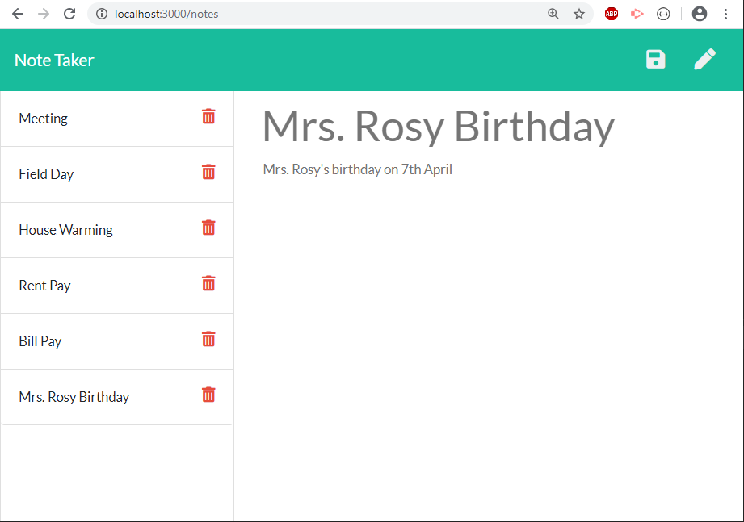

# Note-Taker

  
## Table of contents:
-   [ Description ](#description)
-   [ Installation ](#installation)
-   [ Usage ](#usage)
-   [ Deployed Link ](#link)
-   [ License ](#license)

## <a name="description"></a>Description:
'Note-taker' is an application that can be used to write, save, and delete notes. This application uses an express backend to save and retrieve note data from a JSON file. Powered by Node js and Express.

## <a name="installation"></a>Installation:

```bash
npm init
npm i nodemon -g
npm i express 
```
## <a name="usage"></a>Usage:
```bash
node server or nodemon server
```
## <a name="link"></a>Deployed Link:
-   (https://graphicaction.github.io/resposive_portfolio/)




## <a name="contributing"></a>Contributing:
Pull requests are welcome. For major changes, please open an issue first to discuss what you would like to change.Code of Conduct: Standard (Fork, Clone, Commit, Push and Create Pull requests).

## <a name="license"></a>License:
 <i>MIT Copyright (c). All rights reserved.</i>

